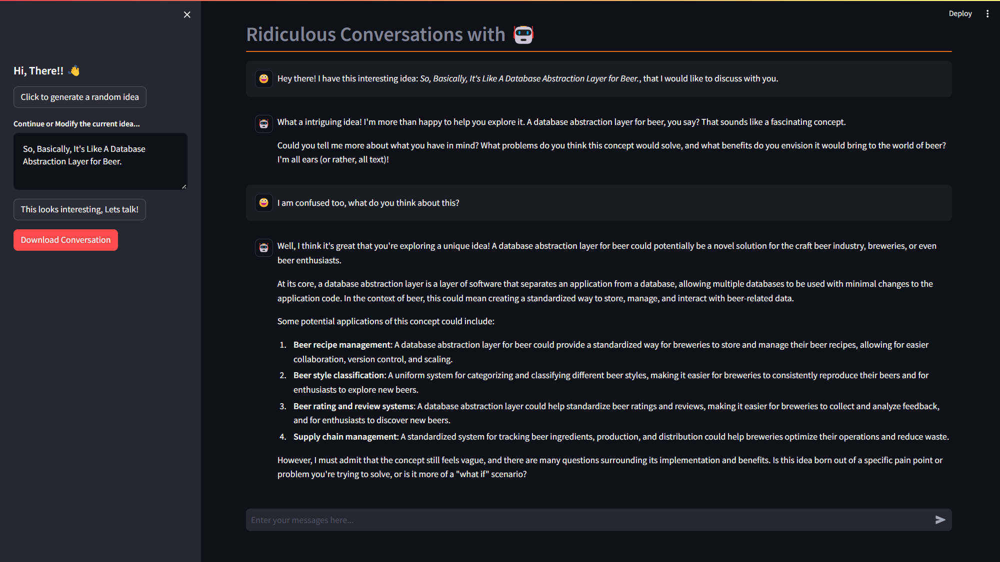

# Ridiculous Conversations with 🤖 
 A web app which lets you converse with an AI on ridiculous ideas.



This [Streamlit](https://streamlit.io/) app generates some crazy ideas based using an open source [API](https://itsthisforthat.com/api.php) and [Groq](https://groq.com/)

## Reqirements
- Execute the following command to install the dependencies.
```
pip install -r requirements.txt
```

## How to use?
- As you open the app, you will see an empty screen. Click on the <b>Click to generate a random idea</b> button. You can click on this button as many times as you want.
- The button will generate a random idea in the below text area, If you like the idea you can continue with it or you can modify the idea before clicking <b>This looks interesting, Lets talk!</b> button.
- This will initiate a conversation with [Llama3](https://llama.meta.com/llama3/) model from [Groq](https://groq.com/).
- You can continue the conversation as long as you want.
- If you like the conversation and would like to download it, you can click on the <b>Download Conversation</b> button, it will help you download your conversational data.

## Customization
The app can be easily customized to incorporate other language models from Groq settings or you can play around with the default parameters.

## Credits
- I learned to work with Groq's API through [The How to guy](https://www.youtube.com/@tonykipkemboi) youtube videos. Do check them out.

## Contribution
The codebase is free to download, modify and distribute.